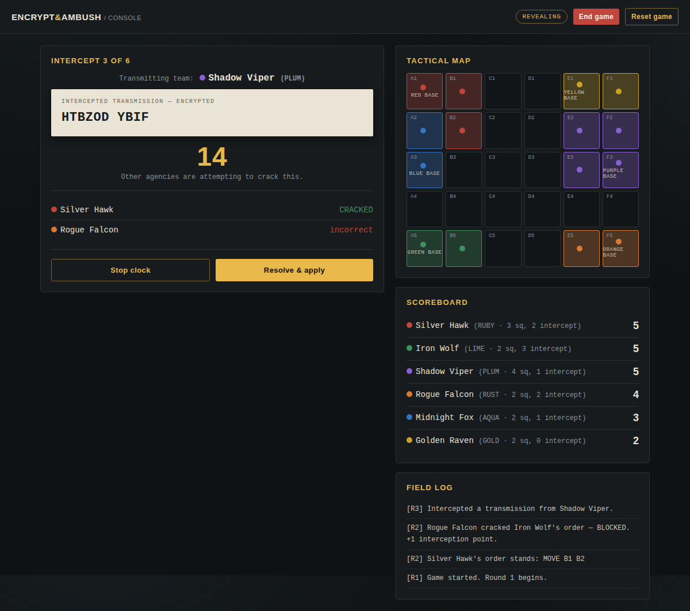
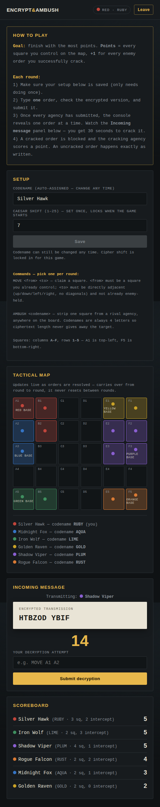

# 🔒 Encrypt & Ambush

**A live, in-browser classroom game for teaching Caesar ciphers and basic cryptanalysis.**

Rival "spy agencies" (student teams) fight for control of a shared digital map. Every
order has to be encrypted before it's sent — and every other team is racing to crack
it before the clock runs out.

---

## What is this?

Encrypt & Ambush is a real-time, multi-device classroom game built as a **single
self-contained web page**. One device (the teacher's, usually projected) runs the
console; every team joins on their own phone or laptop. No app installs, no
accounts for students, no paper.

It was built for teaching the basics of encryption and cryptanalysis — students
directly experience *why* weak ciphers get broken (predictable messages, small
vocabularies, reused keys) rather than just being told about it.

**Curriculum fit:** Digital Technologies / cryptography units (Years 7–10), or as a
lighter, game-based entry point before a more formal treatment in VCE Applied
Computing or similar. Works well as a single 50-minute lesson.

---

## How it plays

1. Teams join automatically — each gets a random codename (e.g. "Silver Hawk") and
   colour, no setup needed beyond choosing a personal Caesar cipher shift (1–25).
2. Each round, every team submits **one** encrypted order:
   - `MOVE <from> <to>` — claim an adjacent square on the shared map
   - `AMBUSH <codename>` — strip a square from a rival agency
3. The console reveals one team's encrypted order at a time. Everyone else has
   **30 seconds** to crack it before it's resolved.
4. Points = squares controlled + 1 for every message you successfully crack.
5. Repeat for several rounds — highest score wins.

Full rules, with diagrams, are built into the app itself (the **"How to play"**
option on the landing screen) — nothing needs explaining verbally.

---

## Features

- **Live multiplayer** across any number of devices, powered by a free Firebase
  backend — no server to run or maintain
- **Up to 6 teams**, auto-assigned a colour and a random codename on join
- **4-letter codenames** for every team (RUBY, AQUA, LIME, GOLD, PLUM, RUST) so
  ciphertext length never gives away who's being targeted
- **Sender identity hidden** during the crack window, on both the console and every
  team's screen — only revealed once the clock stops and it's needed for scoring
- **Live order validation** — students get instant feedback if an order doesn't
  match a real square, a real codename, or the right format, before they can submit
- **A standalone Decoder Wheel** — a visual Caesar-cipher helper any student can
  use any time, independent of the live game, with a built-in cooldown so it can't
  be used to brute-force every shift within the crack window
- **An illustrated "How to Play" page** — step-by-step instructions with diagrams,
  built into the app, plus a quick-access link from every team's own screen
- **A practice round option** — run one full ungraded round to teach the flow,
  then reset straight into the real game without re-entering any team setup
- **Teacher controls**: reshuffle colours, jump to the decoder wheel or back to the
  menu, end the game early, or fully reset back to a clean lobby — all from the
  console's top bar

---

## Getting started

This is one HTML file plus a free Firebase backend. Setup takes about 15 minutes
the first time, and involves no coding.

📖 **[BUILD_GUIDE.md](BUILD_GUIDE.md)** — full setup from scratch: creating the free
Firebase backend, connecting it to the file, and deploying it to a real URL
(covers both a drag-and-drop path and a command-line path).

📖 **[VISUAL_STUDIO_GUIDE.md](VISUAL_STUDIO_GUIDE.md)** — the same setup, but for
teachers who want to manage this through Visual Studio and GitHub rather than a
bare command line.

If you just want to see it running first: open `index.html` in a browser. The
**Decoder Wheel** and **How to Play** pages work immediately with no setup at all
(they don't need the Firebase backend). Joining a team or running a live game does
need the one-time backend setup in the guide above.

---

## What you'll need

| What | Cost |
|---|---|
| A Google account (for the free Firebase backend) | Free |
| A GitHub account (recommended, for storing/updating the file) | Free |
| Any modern browser, on the teacher's device and every team's device | Free |

No installs on student devices. No student accounts or logins. Nothing to mark or
collect afterwards unless you want to.

---

## Tech stack

Everything lives in **one HTML file** — no build step, no framework, no
dependencies beyond two CDN-loaded fonts and the Firebase SDK. State sync between
devices runs on **Firebase Realtime Database** (free tier is more than enough for
classroom use). Hosting is typically **Firebase Hosting**, also free.

This means the whole project is easy to read, easy to fork, and easy to hand to
another teacher — there's no toolchain to set up before you can even open the code.

---

## Known limitations

- Fixed 6×5 board, up to 6 teams, two order types (`MOVE`, `AMBUSH`) — deliberately
  simple, matching a single-lesson format
- One live game at a time per Firebase project — don't run two classes
  simultaneously on the same deployed link without resetting between them
- No login system — team identity lives in the browser's local storage, and the
  underlying database uses open ("test mode") rules, which is a reasonable
  trade-off for a classroom activity but worth knowing about

See `BUILD_GUIDE.md` for the full, detailed list and the reasoning behind each one.

---

## License / sharing

Feel free to copy, adapt, and reuse this for your own classes. No attribution
required, though it's always appreciated. If you make changes worth sharing back,
consider forking the repo so other teachers can benefit too.

---

## Questions or issues?

This was built iteratively for one teacher's classroom, so rough edges are
expected — if something doesn't work as described, check `BUILD_GUIDE.md`'s
troubleshooting section first, then feel free to dig into `index.html` directly;
it's a single file and every function has a short comment explaining what it does.
